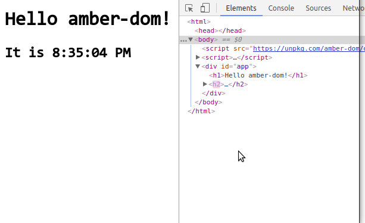

# <center>amber-dom</center>

**amber-dom** is yet another lightweight virtual-dom library without too many concepts. It is simple, robust & efficient.

## Features

- Lightweight & efficient
- Simple, robust & trustful
- Build dom trees in **hyperscript** or **jsx**

## Why Another Virtual Dom Library?

Existing virtual dom libraries are either too sophisticated(that they provide too many concepts & interfaces, which might be unfriendly to newbies), or too simple(that cannot be used seriously). `amber-dom` provides another option. In fact, `amber-dom` is used for study purpose, as you can read the code in an afternoon for every detail of it.

Due to its simplicity, you'll use `amber-dom` easily if you're already familiar with [hyperscript](https://github.com/hyperhype/hyperscript) or [react-jsx](http://facebook.github.io/jsx/).

## Installation

```bash
# create your project directory & cd into it.
mkdir vdom-demo && cd vdom-demo
# install amber-dom
npm i amber-dom
```

## Example

If you don't want any set up, just use a script tag to import `amber-dom` from `node_modules/amber-dom/dist/amberdom-browser.js`. An example of a ticking clock is below:

```html
<html>
  <body>
    <script src="node_modules/amber-dom/dist/amberdom.browser.js"></script>
    <script>
      window.onload = () => {
        const { h, diff, patch } = amberdom
        const state = {                         // set up some UI state.
          time: new Date().toLocaleTimeString()
        }

        let appVTree = h('div#app',             // create a virtual dom tree
          h('h1', 'Hello amber-dom!'),
          h('h2', 'It is ', state.time)
        )
        let appDTree = appVTree.render()        // render to a real dom tree

        function updater() {
          let timer

          updateTime()

          function updateTime() {
            clearTimeout(timer)
            state.time = new Date().toLocaleTimeString()

            let newVTree = h('div#app',
              h('h1', 'Hello amber-dom!'),
              h('h2', 'It is ', state.time)
            )
            let patches = diff(appVTree, newVTree) // diff

            appVTree = newVTree
            patch(appDTree, patches)               // patch
            timer = setTimeout(updateTime, 1000)
          }
        }

        document.body.appendChild(appDTree)     // append to body
        updater()                               // set up updater
      };
    </script>
  </body>
</html>
```

Just copy it and save it to `index.html` on your current root directory, and then open it in your browser. Press `F12`, you should see `amber-dom` updates only what's necessary:



To see tests on `amber-dom`, run:

```bash
cd node_modules/amber-dom

npm run dev
```
Then visit `http://localhost:8080`, you'll see tests.

## Documentation

It is recommanded to read the docs in the following order.

1. For details of creating a virtual dom tree, see [docs/creatingVTree](docs/creatingVTree.md).
2. For details of `diff`, see [docs/diff](docs/diff.md).
3. For details of `patch`, see [docs/patch](docs/patch.md).

## License
MIT